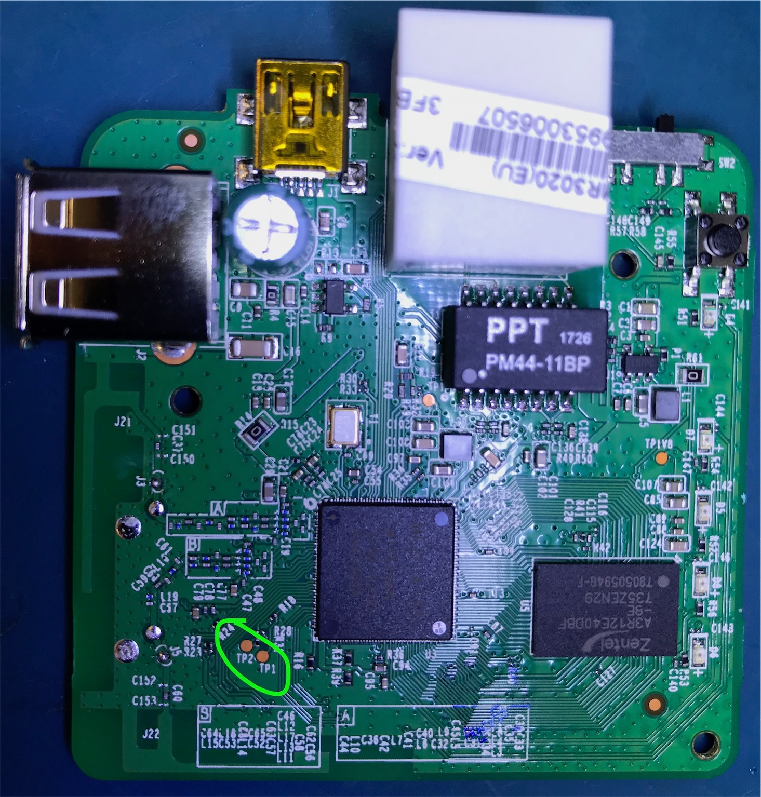

# easy-extroot image
* https://yunofun.wordpress.com/2015/10/31/easy-extroot-for-tplink-mr-3020-router-chaoscalmer-version/


# lede mr3020 extroot
* https://forum.lede-project.org/t/tl-mr3020-lede-extroot/8311/12

# lan client
/etc/config/network
```
config interface 'loopback'
        option ifname 'lo'
        option proto 'static'
        option ipaddr '127.0.0.1'
        option netmask '255.0.0.0'

config globals 'globals'
        option ula_prefix 'fd96:d76f:5a52::/48'

config interface 'lan'
        option ifname 'eth0'
        option force_link '1'
        option type 'bridge'
        option proto 'dhcp'
        option ip6assign '60'
```
/etc/config/wireless
```
config wifi-device  radio0
        option type     mac80211
        option channel  11
        option hwmode   11g
        option path     'platform/ar933x_wmac'
        option htmode   HT20
        option disabled 0

config wifi-iface
        option device   radio0
        option network  lan
        option mode     ap
        option ssid     ...
        option encryption psk2
        option key      ...
```


# TP-Link MR-3020 v3
* The new V3 version of the TP-Link MR-3020 has a different chipset than the previous v1.9. It has a MediaTek MT7628 SoC with MIPS architecture and probably runs a fork of OpenWrt when shipped. 
* There are 2 testpins close to the processor which are the Serial pins. Serial bootlog at 115200bps: <https://gist.github.com/companje/f636daaf57a90a3436f1749885269081>
* [MT7628 Datasheet](http://vonger.cn/upload/MT7628_Full.pdf)
* 

# backup script for saving settings and home folder in failsafe mode
1. start the wifibox in failsafe mode
2. set your local IP to 192.168.1.2
3. run this script locally
(it starts a netcat server in the background and then executes remote commands through telnet)

```bash
nc -l 192.168.1.2 3333 > backup.tar.gz &
{ 
  echo "sysupgrade --create-backup /tmp/backup.tar.gz" ; # sysupgrade executed remotely
  sleep 5;  # local
  echo "nc 192.168.1.2 3333 < /tmp/backup.tar.gz" ; # # nc executed remotely
  sleep 5;  # local
} | telnet 192.168.1.1
```

# ser2net
* it looks to me like ser2net can not communicate on 250000 bps.
* there is a version/fork of ser2net that can do http/websockets.

# extroot summary
on osx: 
```bash
diskutil list
diskutil unmount /dev/disk#s#
sudo $(brew --prefix e2fsprogs)/sbin/mkfs.ext4 /dev/disk#s#
```

on openwrt 
```bash
opkg update
opkg install block-mount kmod-usb-storage kmod-fs-ext4
reboot
block info
mkdir /mnt/usb
mount /dev/sda1 /mnt/usb
ls /mnt/usb # to check...
#copy everything to usb
mkdir -p /tmp/cproot
mount --bind / /tmp/cproot
tar -C /tmp/cproot -cvf - . | tar -C /mnt/usb -xf -
umount /tmp/cproot

#confiure fstab
cat >> /etc/config/fstab << EOF
config mount
        option target        /
        option device        /dev/sda1
        option fstype        ext4
        option options       rw,sync
        option enabled       1
        option enabled_fsck  0
EOF
reboot
df -h
```


# backup and restore config files

a nice workflow seems to be to backup config files using scp when you've got a working setup.
```bash
scp wifibox:/etc/config/* .
```

then you can mess up everything (even reflashing the device) and then to restore the configuration just run:

```bash
scp * wifibox:/etc/config/
```

(also checkout `sysupgrade --create-backup /tmp/backup.tar.gz` It creates a tar with the contents of the whole `/etc` folder)

# UCI show

```bash

uci show firewall
#result:
#  firewall.@defaults[0]=defaults
#  ...
#  firewall.@zone[1].network='wan' 'wan6' 'wwan'    #this is called a list
```

# UCI add_list

```bash
uci add_list firewall.@zone[1].network='TEST'
```

# AP+STA

```bash
#root@OpenWrt:~# cat connect
STA_SSID=Vechtclub XL F1.19
STA_KEY=XXXXXXXXXX
AP_SSID=Doodle3D
AP_KEY=1234567890

set -x

uci set dhcp.@dnsmasq[0].rebind_protection=0
uci add_list firewall.@zone[1].network='wwan'

uci add wireless wifi-iface
uci set network.lan.ipaddr=192.168.6.1
uci set network.wan=interface
uci set network.wan.proto=dhcp
uci set network.wwan=interface
uci set network.wwan.proto=dhcp

uci delete wireless.@wifi-device[0].disabled
uci set wireless.@wifi-iface[0].network=wwan
uci set wireless.@wifi-iface[0].mode=sta
uci set wireless.@wifi-iface[0].encryption=psk2
uci set wireless.@wifi-iface[0].ssid="$STA_SSID"
uci set wireless.@wifi-iface[0].key="$STA_KEY"

uci set wireless.@wifi-iface[1].device=radio
uci set wireless.@wifi-iface[1].network=lan
uci set wireless.@wifi-iface[1].mode=ap
uci set wireless.@wifi-iface[1].encryption=psk2
uci set wireless.@wifi-iface[1].ssid="$AP_SSID"
uci set wireless.@wifi-iface[1].key="$AP_KEY"

uci commit
wifi
```

# Connect
```bash
#root@OpenWrt:~# cat connect
set -x
uci set network.lan.ipaddr=192.168.5.1
uci delete wireless.@wifi-device[0].disabled #enable radio
uci set wireless.@wifi-iface[0].network=wan
uci set wireless.@wifi-iface[0].mode=sta
uci set wireless.@wifi-iface[0].ssid="Vechtclub XL F1.19"
uci set wireless.@wifi-iface[0].key=XXXXXX
uci set wireless.@wifi-iface[0].encryption=psk2
uci set network.wan=interface
uci set network.wan.proto=dhcp #get ip from router
uci commit
wifi
```

# loglite voor wifibox
firmware / web server  api logs: `cat /tmp/wifibox.log | loglite`
print3d logs: `cat /tmp/print3d-ttyACM0.log | loglite`

# auto flash wifibox
```bash
#!/bin/bash

ln -s `realpath $0` ~/bin/flash > 2&>null #installs this script as executable 'flash'

if [[ $# -ne 2 ]] ; then
    echo "Usage: flash {HOST} {FILE.BIN}"
    exit 1
fi

if [ ! -f $2 ]; then
    echo "File not found: $2"
    exit 1
fi

host=$1
firmware=$2

#add myself to the autorized keys on the wifibox
cat ~/.ssh/id_rsa.pub | ssh root@$host 'cat > /etc/dropbear/authorized_keys'

#upload the file to the wifibox:/tmp/
scp "$2" root@$host:/tmp/

#sysupgrade the wifibox
ssh root@$host sysupgrade -v /tmp/$(basename $2)
```

# install doodle3d-client in docker container
```bash
scripts/feeds update customfeeds
scripts/feeds install doodle3d-client
cat /home/openwrt/config/diffconfig >> .config
make defconfig
#make V=s package/doodle3d-client/compile
#make V=s
cp -r bin /home/openwrt/shared/
```
but check also [[https://github.com/Doodle3D/openwrt-buildroot/blob/master/dockerfile/Build.sh|build.sh]]
   
# wifibox .profile
```bash
root@wifibox:~# cat .profile
# DO NOT MODIFY - this block of lines has been added by the wifibox package.
alias d='ls -la'
alias encore='ulimit -c unlimited'
alias wopkg='opkg -f /usr/share/lua/wifibox/opkg.conf'

alias tailfw='loglite /tmp/wifibox.log firmware'
tailp3d() {
  logfile=/tmp/print3d-ttyACM0.log
  if [ $# -gt 0 ]; then logfile=$1; fi
  loglite "$logfile" print3d
}
```

# image generator test doodle3d with docker
https://github.com/Doodle3D/openwrt-buildroot/tree/image-generator-test

# BIN_DIR: custom output folder for packages
```
make package/doodle3d-firmware/compile BIN_DIR="/home/openwrt/shared/bin/" V=s
```

# install print3d
```bash

scripts/feeds update customfeeds
scripts/feeds install print3d
make package/print3d/compile
```

# install doodle3d-firmware (package name = wifibox)
```bash
scripts/feeds update customfeeds
scripts/feeds install wifibox   #where 'wifibox' is actually the package in 'doodle3d-firmware' repo
make package/doodle3d-firmware/compile # but make seems to use the name of the folder instead of the name of the package
```


# Makefile:5: *** missing separator.  Stop.
this might indicate spaces instead of tabs in one of your Makefile

# SDK: glob failed: No files found "package/utils/busybox/config/libbb/Config.in"
(possible) solution:
`ln -s ../feeds/base/package/utils package/utils`

# SDK: configure: error: C compiler cannot create executables
solution: install 'ccache' on the host system (Ubuntu in my case)

# minimal file upload using cgi script from stdin to /dev/null (or usb)
```html
<form target="frm" action="http://192.168.5.1/cgi-bin/test.sh" enctype="multipart/form-data" method="post">
<input type="file" name="datafile" size="40">
<input type="submit" value="Send">
</form>
<iframe name="frm" width="100%" height="300">
</iframe>
```

```bash
#!/bin/sh
echo "Content-type: text/plain"
echo ""
env
- > /dev/null  # or cat > /dev/null
echo "ok"
echo ""
echo ""
```

# tail logs through netcat
on router:
```logread -f | nc 192.168.5.111 8081```

on pc:
```nc -l 192.168.5.111 8081```

# system.lua source
* https://github.com/openwrt/luci/blob/f7ec630913a4eadea0b9927881f62b095bc95563/modules/luci-mod-admin-full/luasrc/controller/admin/system.lua#L233

# How to transfer a file from OpenWrt to your computer in Failsafe mode
On OpenWrt
```bash
sysupgrade --create-backup /tmp/backup.tar.gz   # create the file
nc 192.168.1.2 3333 < /tmp/backup.tar.gz        # push the file to the netcat server on your computer
```

On your computer: 
```bash
nc -l 192.168.1.2 3333 > backup.tar.gz          # run a server to receive the file from the router
```

# Flash new firmware in failsafe mode (via netcat)
* https://wiki.openwrt.org/doc/howto/generic.failsafe#flash_new_firmware_in_failsafe_mode

# read sliding switch on boot to select network configuration
* https://forum.openwrt.org/viewtopic.php?pid=172111#p172111

# info about file upload/post to openwrt
* https://forum.piratebox.cc/read.php?3,15911,15911
* ...

# image generator osx
```bash
docker run -it ubuntu /bin/bash
apt-get update
apt-get install subversion build-essential libncurses5-dev zlib1g-dev gawk git ccache gettext libssl-dev xsltproc
make image PROFILE=TLMR3020 PACKAGES="kmod-usb-storage block-mount kmod-fs-ext4 kmod-usb-serial-ftdi kmod-usb-serial kmod-usb-acm uclibcxx liblua libuci luafilesystem libuci-lua libiwinfo-lua uhttpd uhttpd-mod-lua libusb-1.0 libncurses openssh-sftp-server -luci"
#last step fails
```

# minimale aanpak
verbind met internetverbinding van je router
```bash
uci set network.lan.ipaddr=192.168.5.1
uci delete wireless.@wifi-device[0].disabled #enable radio
uci set wireless.@wifi-iface[0].network=wan
uci set wireless.@wifi-iface[0].mode=sta
uci set wireless.@wifi-iface[0].ssid=Baksteen
uci set wireless.@wifi-iface[0].key=...
uci set wireless.@wifi-iface[0].encryption=psk2
uci set network.wan=interface 
uci set network.wan.proto=dhcp #get ip from router
uci commit
wifi
```

# avahi voorbeelden toevoegen voor Bonjour/zeroconf:
```bash
opkg update
opkg install avahi-daemon-service-ssh avahi-daemon-service-http
```

# uhttpd installeren
```bash
opkg update
opkg install uhttpd
echo hoi > /www/index.html
mkdir /www/cgi-bin
#plaats een cgi script zie companje.nl/openwrt
```

# wget
standaard zit er al wget op. dat zit in busybox. maar het ondersteund geen SSL.

# RAM
tmpfs heeft ongeveer 13MB RAM vrij. dus wget zou in principe een bestand van die grootte moeten kunnen bewaren in /tmp. (getest met een GIFje, dat gaat goed). Maar beter wat ruimte overlaten.

# ser2net
```bash
opkg update
opkg install ser2net
#wat info hier: https://wiki.openwrt.org/doc/howto/fhem
#en hier een filmpje: https://www.youtube.com/watch?v=_OVRr69Apl0
vi /etc/ser2net.conf
#alle /dev devices uitcommenten behalve degene van jouw seriele poort, of die toevoegen:
# 1234:raw:0:/dev/ttyACM0:9600
```

eerst misschien nog driver voor USBserieel installeren:
```bash
opkg install kmod-usb-acm
```
vervolgens kun je als ser2net draait letterlijk via telnet ontvangen en versturen.
maar ja.. je wil het liefst een groot bestand in stukje gaan binnenhalen vanaf het web en ook in stukjes sturen vanaf de box zelf naar de seriele poort… Dus misschien is UltiFi (https://github.com/daid/UltiFi) of iets anders zelf geschreven nog niet zo gek.


# minimal settings for internet and lan
```bash
uci set network.lan.ipaddr=192.168.5.1
uci delete wireless.@wifi-device[0].disabled #enable radio
uci set wireless.@wifi-iface[0].network=wan
uci set wireless.@wifi-iface[0].mode=sta
uci set wireless.@wifi-iface[0].ssid=........
uci set wireless.@wifi-iface[0].key=........
uci set wireless.@wifi-iface[0].encryption=psk2
uci set network.wan=interface 
uci set network.wan.proto=dhcp #get ip from router
uci commit
```

# settings from Doodle3D WiFi-Box
* [[https://gist.github.com/companje/c2cc92a513bd5aae5f0ec54aaefded60#file-wireless|/etc/config/wireless]]
* [[https://gist.github.com/companje/c2cc92a513bd5aae5f0ec54aaefded60#file-network|/etc/config/network]]
* [[https://gist.github.com/companje/c2cc92a513bd5aae5f0ec54aaefded60#file-dhcp|/etc/config/dhcp]]
* [[https://gist.github.com/companje/c2cc92a513bd5aae5f0ec54aaefded60#file-firewall|/etc/config/firewall]]

# Disabling default route and DNS server for lan network interface
This way you don't have to set the order of WiFi and Ethernet.

```bash
uci set dhcp.lan.dhcp_option='3 6'
uci commit dhcp
/etc/init.d/dnsmasq reload
```

# add custom Bonjour/mDNS/zeroconf etc service
/etc/avahi/services/3dprint.service
```xml
<?xml version="1.0" standalone='no'?><!--*-nxml-*-->
<!DOCTYPE service-group SYSTEM "avahi-service.dtd">
<service-group>
 <name replace-wildcards="yes">%h</name>
  <service>
   <type>_3dprint._tcp</type>
   <port>80</port>
  </service>
</service-group>
```

/etc/init.d/avahi-daemon reload

# discussion about doodle3d network module
* https://github.com/Doodle3D/doodle3d-firmware/issues/32
* https://github.com/Doodle3D/doodle3d-client/issues/224

# dev tutorials
* http://watchmysys.com/blog/2015/10/build-package-your-software-for-openwrt/
* http://www.ccs.neu.edu/home/noubir/Courses/CS6710/S12/material/OpenWrt_Dev_Tutorial.pdf
* http://wiki.prplfoundation.org/wiki/Creating_an_OpenWrt_package_for_a_web_page

# own packages
* https://github.com/companje/doorbell
* https://github.com/companje/up3dload

# clone package source
to have the make file clone from the `PKG_SOURCE_URL` update the `PKG_VERSION`


# ./up3dload: line 1: syntax error: unexpected "("
Cause: When you get this error on the binary you try to run on your OpenWrt device has the wrong architecture. Run file up3dload to see the architecture.

Solution: Make sure the .o files and the osx executable are not copied to the build_dir. Perform a make clean in the src/ folder of the package before make package/up3dload/compile when you did a make in your src folder to test locally.

# get all strings from a binary
```bash
strings testscript
```

# /bin/ash: testscript: not found
```
/bin/ash: testscript: not found
```
`file not found` usually means that a dependant library wasn't found.

```bash
file /Volumes/OpenWrt/openwrt/build_dir/target-mips_34kc_musl-1.1.14/testscript/ipkg-ar71xx/testscript/bin/testscript
```

```
/Volumes/OpenWrt/openwrt/build_dir/target-mips_34kc_musl-1.1.14/testscript/ipkg-ar71xx/testscript/bin/testscript: ELF 32-bit MSB executable, MIPS, MIPS32 rel2 version 1, 
dynamically linked (uses shared libs), corrupted section header size
```

this was caused by having installed the downloaded binary of OpenWrt 15.05 instead of the one I compiled against. Maybe the difference between uClibC vs musl?

# default_postinst: not found
probably because trying to install a package compiled on 15.05 to a 14.07.

# build single package
tutorial: https://manoftoday.wordpress.com/2007/10/11/writing-and-compiling-a-simple-program-for-openwrt/

(different snippets)
```bash
./scripts/feeds update customfeeds
./scripts/feeds install up3dload

# ? ./scripts/feeds update -a
# ? ./scripts/feeds install testscript
...
make package/testscript/prepare
make package/testscript/compile -j1 V=s
make package/testscript/install
...
make package/print3d/prepare
make package/print3d/compile
make package/print3d/install
make package/index
```

# zsun
* http://www.coyne.nu/blog/2016/01/31/installing-openwrt-on-the-zsun-wifi-card-reader-from-windows/
* https://forum.openwrt.org/viewtopic.php?id=62555
* https://wiki.hackerspace.pl/projects:zsun-wifi-card-reader
* http://www.cnx-software.com/2016/01/25/zsun-wifi-card-reader-can-now-run-openwrt/
* < "is there a way to 'unmount' the SD card (by writing to a GPIO or so?) so it becomes available again to the computer that powers the device?" > "Setting GPIO21 to high should connect the reader to the PC, you may also need to toggle GPIO18 low and high to reset the card reader."

# [Howto](AAP) Automated Wifi network change if the current fails
* https://forum.openwrt.org/viewtopic.php?pid=309131#p309131

# AP + STA at the same time
* https://wiki.openwrt.org/doc/recipes/ap_sta

# Stappen Image Builder
* staat op : `rick@ubuntu:~/Desktop/OpenWrt-ImageBuilder-15.05-ar71xx-generic.Linux-x86_64`

* start Linux (bijv in Parallels met de mogelijkheid om vanaf OSX te verbinden via SSH)
* download: https://downloads.openwrt.org/chaos_calmer/15.05/ar71xx/generic/OpenWrt-ImageBuilder-15.05-ar71xx-generic.Linux-x86_64.tar.bz2
* untar: 
```bash
tar -xvjf OpenWrt-ImageBuilder-15.05-ar71xx-generic.Linux-x86_64.tar.bz2
```

* zorg voor dependencies: 
```bash
apt-get install subversion build-essential libncurses5-dev zlib1g-dev gawk git ccache gettext libssl-dev xsltproc
```

* voeg customfeeds toe aan de packages folder (maak een mapje customfeeds met daarin ipk bestanden van je customfeeds dus die moet je wel eerst ergens bouwen)
```bash
mkdir packages/customfeeds
```

* run image generator
```bash
make image PROFILE=TLMR3020 PACKAGES="wifibox -ppp -kmod-ipv6"
```

* creates image in bin/ar71xx folder. scp ….squashfs-sysupgrade.bin file to the /tmp folder of the box and run 
```bash
sysupgrade -v- n /tmp/openwrt….squashfs-sysupgrade.bin
```
* Er was nog een probleem met dat er iets niet geconfigureerd was als je het gemaakte image op een wifibox plaatste. Volgens mij werd de print3d niet automatisch opgestart of herstart. inotify ging niet goed ofzo omdat dat een SETTING was ipv een DEPENDENCY.


# ch340 driver info
http://www.ibuyopenwrt.com/index.php/8-yun-compatible/146-usb-serial-adapter-ch340

# updated sources list for barrier_breaker
`/etc/opkg.conf`
```bash
dest root /
dest ram /tmp
lists_dir ext /var/opkg-lists
option overlay_root /overlay
src/gz barrier_breaker_base http://downloads.openwrt.org/barrier_breaker/14.07/ar71xx/generic/packages/base
src/gz barrier_breaker_telephony http://downloads.openwrt.org/barrier_breaker/14.07/ar71xx/generic/packages/telephony
src/gz barrier_breaker_oldpackages http://downloads.openwrt.org/barrier_breaker/14.07/ar71xx/generic/packages/oldpacka
src/gz barrier_breaker_packages http://downloads.openwrt.org/barrier_breaker/14.07/ar71xx/generic/packages/packages
src/gz barrier_breaker_routing http://downloads.openwrt.org/barrier_breaker/14.07/ar71xx/generic/packages/routing
src/gz barrier_breaker_luci http://downloads.openwrt.org/barrier_breaker/14.07/ar71xx/generic/packages/luci
src/gz barrier_breaker_management http://downloads.openwrt.org/barrier_breaker/14.07/ar71xx/generic/packages/managemen
```

# set baudrate in uboot
http://www.denx.de/wiki/view/DULG/UBootEnvVariables: baudrate: a decimal number that selects the console baudrate (in bps). Only a predefined list of baudrate settings is available. 
When you change the baudrate (using the "setenv baudrate ..." command), U-Boot will switch the baudrate of the console terminal and wait for a newline which must be entered with the new speed setting. This is to make sure you can actually type at the new speed. If this fails, you have to reset the board (which will operate at the old speed since you were not able to saveenv the new settings.) 
If no "baudrate" variable is defined, the default baudrate of 115200 is used.

* connect to serial: `screen /dev/tty.usbserial 115200`
* type `tpl` when 'Autobooting' message is visible
* `printenv` to see variables
* `setenv baudrate 9600` gives error `Baudrate 9600 bps not supported`


# Allow SSH on WAN interface
Add to /etc/config/firewall
```bash
config rule
        option name             allow-SSH-wan
        option src              wan
        option proto            tcp
        option dest_port        22
        option target           ACCEPT
        option family           ipv4
```
restart firewall service
  /etc/init.d/firewall reload

# Allow HTTP on WAN interface
Add to /etc/config/firewall
```bash
config rule
        option name             allow-HTTP-wan
        option src              wan
        option proto            tcp
        option dest_port        80
        option target           ACCEPT
        option family           ipv4
```
restart firewall service
  /etc/init.d/firewall reload


# hostapd
  /lib/netifd
  /var/run

# documentation for 'iw'
https://wireless.wiki.kernel.org/en/users/Documentation/iw

# change ip temporary
  ifconfig eth0 192.168.5.1

# failsafe tftp
* on OSX start TFTP server: http://www.appletips.nl/tftp-deamon-activeren-onder-os-x/
* put openwrt factory firmware in your tftp folder
* Then follow the steps for the MR3020: http://wiki.openwrt.org/toh/tp-link/tl-mr3020

# nexx3020
* http://wiki.openwrt.org/toh/nexx/wt3020
# wifi status
  wifi status
  
# netwerk status
  cat /var/state/network

# openwrt mirror op github
* https://github.com/openwrt-mirror/openwrt/

# setup wireless AccessPoint & connect as a station to an existing WiFi network (simultaneously)
```bash
# remove default OpenWrt AccessPoint
uci delete wireless.@wifi-device[0].disabled
uci delete wireless.@wifi-iface[0]

# Wireless AccessPoint
uci set wireless.ap=wifi-iface
uci set wireless.ap.device=radio0
uci set wireless.ap.network=lan
uci set wireless.ap.mode=ap
uci set wireless.ap.encryption=none
uci set wireless.ap.ssid=Doodle3D

# Wireless Station
uci set wireless.sta=wifi-iface
uci set wireless.sta.network=wan
uci set wireless.sta.mode=sta
uci set wireless.sta.ssid=Baksteen
uci set wireless.sta.key=XXXXXXXXXXXXXXXXXXXXXXXXXXXXXXXXXXXXXXX
uci set wireless.sta.encryption=psk2
uci set wireless.sta.device=radio0

# Setup network interface ‘lan’ to be used by Wireless AccessPoint
uci delete network.lan.ifname
uci set network.wan=interface
uci set network.wan.proto=dhcp
uci set network.lan.ipaddr=192.168.10.1

# Save settings
uci commit
```

# restore from rom
`mtd -r erase rootfs_data`
better solution: `firstboot`

# uci defaults
create `/etc/uci-defaults/my-uci-defaults`. It will be executed once when the router boots. When it exits with 0 the file will be deleted.
```bash
#!/bin/sh
uci set network.lan.ipaddr=192.168.5.1
uci commit network
exit 0
```

# AP+STA tegelijk
* [[https://www.gargoyle-router.com/gargoyle/projects/gargoyle/repository/revisions/master/entry/patches-generic/04-arpnat.patch|Gargoyle patch]]

# jsonfilter!!!
uitproberen!
http://git.openwrt.org/project/jsonpath.git?p=project/jsonpath.git;a=blob;f=main.c;h=85a53f4af40e4d02429ee2fdfda597780b7e1f96;hb=HEAD

# ubus over http
* `uhttpd-mod-ubus`
* `/usr/share/rpcd/acl.d`
* `/etc/init.d/rpcd restart`
* `curl -d '{ "jsonrpc": "2.0", "id": 1, "method": "call", "params": [ "00000000000000000000000000000000", "network.interface.lan", "status", { } ] }'  http://wifibox/ubus`

# ubus
* how to join a network with ubus?
* how to open een AP with ubus?
* http://wiki.openwrt.org/zh-cn/doc/techref/ubus
* `ubus list`
* `ubus -v list network.interface.lan`
* `ubus call iwinfo scan '{"device":"wlan0"}'`
* `ubus call network.interface.lan up`
* `ubus call network.interface.wan up`
# buildroot
http://buildroot.uclibc.org/ is een losstaand project

# Build dependency: Please install the openssl library (with development headers)
(in doodle3d buildroot with ubuntu when trying to `make menuconfig` after deleting Barrier Breaker trunk and cloning 15.05 Chaos Calmer)
  sudo apt-get update
  sudo apt-get install libssl-dev

# get list of installed packages
  echo $(opkg list_installed | awk '{ print $1 }')

# openwrt sdk
* http://wiki.openwrt.org/doc/howto/obtain.firmware.sdk
```bash
./scripts/feeds update
./scripts/feeds install -a
```

# image generator / imagebuilder
* http://wiki.openwrt.org/doc/howto/obtain.firmware.generate
  make info
  (geeft naam van de PROFILES en welke Packages daar standaard bij zitten. Daar kun je packages aan toevoegen en verwijderen met bijv `-luci`
  make image PROFILE=.... PACKAGES="........ openssh-sftp-server -luci"
  
# octoprint on OpenWrt
* http://csmatt.com/notes/?p=154

# serial pins on the mr3020
(::mr3020-serial-pins.jpg?direct&450|)

# buttons on the mr3020
* http://wiki.openwrt.org/doc/howto/hardware.button
* change network settings with slider switch: http://www.linux-magazine.com/Online/Features/The-One-Watt-Server

```bash
opkg update
opkg install kmod-button-hotplug --force-depends
mkdir /etc/hotplug.d/button
```
create a file `/etc/hotplug.d/button/my-script` with your script:
```bash
#!/bin/sh
sleep 1
logger "log: $BUTTON -- $ACTION  -- $SEEN"
```

# luci2
* http://wiki.openwrt.org/doc/techref/luci2

# lua serial on openwrt
* http://lua-users.org/lists/lua-l/2013-03/msg00929.html


# veel handige info
* http://thebird.nl/hardware/OpenWRT_On_Netgear_WNDR3700.html
* http://wiki.acemonstertoys.org/Tp-link_router

# USB-drive support on a Doodle3D WiFi-Box
* have the box join an existing WiFi network to get internet access
* `opkg update`
* `opkg install block-mount`
* `opkg install kmod-usb-storage`
Error: 
 collected errors:
 satisfy_dependencies_for: Cannot satisfy the following dependencies for kmod-usb-storage:
 kernel (= 3.10.49-1-0114c71ed85677c9c1e4911437af4743) - kernel (= 3.10.49-1-0114c71ed85677c9c1e4911437af4743) 
 opkg_install_cmd: Cannot install package kmod-usb-storage.

This is because Doodle3D creates a custom firmware image. Because of this the kernel version/id is different. kmod-usb-storage needs the exact right kernel version.

Solution:
1) Install all the Doodle3D packages on a clean OpenWrt image.
2) Add the `kmod-usb-storage` package to the firmware  (in `make menuconfig`)

* https://kbu.freifunk.net/2015/04/Building-OpenWRT/

# mDNS, ZeroConf, Bonjour etc...
* http://wiki.openwrt.org/doc/howto/zeroconf
* http://wiki.openwrt.org/doc/howto/sftp.server

# Multiple Access Points per radios (Multiple SSID's)
http://trac.gateworks.com/wiki/OpenWrt/wireless/access_point

# replace dropbear by openssh-server
http://wiki.openwrt.org/inbox/replacingdropbearbyopensshserver

# ubus
Accessing utilities like iwinfo through ubus might also be interesting, see: 
http://wiki.openwrt.org/doc/techref/ubus#lua_module_for_ubus
https://forum.openwrt.org/viewtopic.php?id=57554

De nieuwe Luci (LuCI2) lijkt ook ubus over http te gebruiken? 
http://wiki.openwrt.org/doc/techref/luci2
http://wiki.openwrt.org/doc/techref/ubus#access_to_ubus_over_http

# steps to get started with extroot
* flash the wifibox with a regular OpenWrt image (May be one be without LUCI to save diskspace)
* connect an ethernet cable between the wifibox and your computer
* setup your computer's ethernet interface to 192.168.1.2/24 (/24 means subnetmask 255.255.255.0)
* `telnet to 192.168.1.1`
* set a password with `passwd` to enable ssh
* exit telnet
* `ssh root@192.168.1.1`
* `vi /etc/config/network`
* optional: choose another static ipaddress for the LAN connection (for example 192.168.5.1)
* add an interface for wlan setting the protocol to dhcp 

```
config interface wlan
option proto 'dhcp'
```

* exit vi (`ESC`, `:`, `w`, `q`)
* `vi /etc/config/wireless`
* remove the `disabled` option (in vi use `dd` to remove a line)
* add the `country` option and set to `NL` (or other country code) (don't know why this is needed but otherwise 'Network is unreachable')
* change the `mode` of the wifi-iface to 'sta' (to become a WiFi client/station instead of an accesspoint)
* change the wifi-iface `network` to `wlan`
* set the `ssid` option to that of your home WiFi network.
* set the `key` to your network's password.
* choose the right `encryption` for example `psk2`.
* exit vi
* `reboot`
* set your computer's ethernet interface to receive a DHCP address.
* connect with ssh
* update the packages list: `opkg update`
* `opkg install block-mount kmod-usb-storage kmod-fs-ext4`
* in case you get this error: `kmod: failed to insert /lib/modules/3.10.49/ext4.ko` reboot your OpenWRT device
* on your computer setup a ext3 or ext4 filesystem on a USB drive

```bash
diskutil list
diskutil unmount /dev/disk#s#
#brew install e2fsprogs   
sudo $(brew --prefix e2fsprogs)/sbin/mkfs.ext4 /dev/disk#s#
```

* connect the usb drive to the OpenWrt and type `block info` to get info about the block devices. Check if /dev/sda1 is listed.
* create a folder to mount the drive to `mkdir /mnt/usb`
* mount sda1 to the new folder `mount /dev/sda1 /mnt/usb`
* (if you get a Segmentation Fault reboot the box first)
* (if you get an 'Invalid Argument'... then check if ext4 is listed in `cat /proc/filesystems`. If not then probably something went wrong while installing `kmod-fs-ext4`, out of diskspace for example.)
* copy all files on the device to the usb drive:

```bash
mkdir -p /tmp/cproot
mount --bind / /tmp/cproot
tar -C /tmp/cproot -cvf - . | tar -C /mnt/usb -xf -
umount /tmp/cproot
```

* mount the drive on boot by adding settings to `/etc/config/fstab`:

```bash
cat >> /etc/config/fstab << EOF
config mount
        option target        /
        option device        /dev/sda1
        option fstype        ext4
        option options       rw,sync
        option enabled       1
        option enabled_fsck  0
EOF
```

* reboot the device.
* type `mount` to see if your usb drive (`/dev/sda1`) is mounted to `/`
* use `df -h` to see the large amount of space available now!
* note that the contents of `/etc/config/fstab` is now different. This is normal because the contents of the file on the device is different then the one on the usb drive. The usb drive is installed 'on top of' the original filesystem. When booting the device without the usb drive you will get your original files.

* Thanks to https://www.loganmarchione.com/2014/10/openwrt-with-openvpn-client-on-tp-link-tl-mr3020/

# a5v11
* http://wiki.openwrt.org/toh/unbranded/a5-v11

# 'bordjes'
* https://www.kickstarter.com/projects/706167548/dominoio-an-open-hardware-wifi-platform-for-things
* https://www.kickstarter.com/projects/1133560316/black-swift-tiny-wireless-computer/
* https://www.kickstarter.com/projects/onion/onion-omega-invention-platform-for-the-internet-of?ref=category
* Ook interessant is die Node.js port van Tessel (http://tessel.io/). Ben benieuwd of we daarmee dingen zoals socket.io kunnen doen zonder USB stick. Same goes for Espruino (http://www.espruino.com), zie:
https://forum.openwrt.org/viewtopic.php?pid=264395#p264395
* http://sodaq.com/ (arduino based)
* http://www.dragino.com/

# packages
* http://downloads.openwrt.org/barrier_breaker/14.07/ar71xx/generic/packages/base/
* [[http://downloads.openwrt.org/barrier_breaker/14.07/ar71xx/generic/packages/base/libpthread_0.9.33.2-1_ar71xx.ipk|libpthread]]
* [[http://downloads.openwrt.org/barrier_breaker/14.07/ar71xx/generic/packages/base/librt_0.9.33.2-1_ar71xx.ipk|librt]]

# image generator
* http://wiki.openwrt.org/doc/howto/obtain.firmware.generate

# extroot
* http://wiki.openwrt.org/doc/howto/extroot

# fstab
* http://wiki.openwrt.org/doc/uci/fstab

# boot from USB
* http://www.loganmarchione.com/2014/10/openwrt-with-openvpn-client-on-tp-link-tl-mr3020/

# list installed packages
  opkg list

# make & scp & sysupgrade
  make
  scp /Volumes/OpenWRT/trunk/bin/ar71xx/openwrt-ar71xx-generic-tl-mr3020-v1-squashfs-sysupgrade.bin wifibox:/tmp
  ssh wifibox sysupgrade -v -n /tmp/openwrt-ar71xx-generic-tl-mr3020-v1-squashfs-sysupgrade.bin
  
oneliner: cat & make & scp & ssh sysupgrade
  cat ~/.ssh/id_rsa.pub | ssh wifibox 'cat >> /etc/dropbear/authorized_keys' && make V=s && scp /Volumes/OpenWRT/trunk/bin/ar71xx/openwrt-ar71xx-generic-tl-mr3020-v1-squashfs-factory.bin wifibox:/tmp && ssh wifibox sysupgrade -n -v /tmp/openwrt-ar71xx-generic-tl-mr3020-v1-squashfs-factory.bin

# add public key to authorized_keys on openwrt
  cat ~/.ssh/id_rsa.pub | ssh root@192.168.5.1 'cat >> /etc/dropbear/authorized_keys'
or
  cat ~/.ssh/id_rsa.pub | ssh wifibox 'cat >> /etc/dropbear/authorized_keys'
  
after that it easy to scp files without entering passwords.
  scp /Users/rick/Documents/Doodle3D/3dprintserver/doodle3d-firmware/src/rest/api/api_sketch.lua wifibox:/usr/share/lua/wifibox/rest/api

# scp file when local file changes
[[http://superuser.com/questions/181517/how-to-execute-a-command-whenever-a-file-changes|source]]

```bash
#!/bin/bash

while true    
do
   ATIME=`stat -f %Z $1`

   #echo $ATIME --- $LTIME
   if [[ "$ATIME" != "$LTIME" ]]
   then    
       echo "scp $1 $2"
       scp $1 $2
       LTIME=$ATIME
   fi
   sleep 1
done
```

# building
* http://www.doodle3d.com/help/wiki/building-openwrt-wifibox

# error building package
```bash
make[3]: *** No targets specified and no makefile found.  Stop.
make[2]: *** [/Volumes/OpenWRT/trunk/build_dir/target-mips_34kc_uClibc-0.9.33.2/bell/.built] Error 2
make[2]: Leaving directory /Users/rick/Documents/VechtclubXL/door-bell
make[1]: *** [package/feeds/bell/door-bell/compile] Error 2
make[1]: Leaving directory /Volumes/OpenWRT/trunk
```

in our case the folder-name containing the package did not match the package name.

# while adding packages: Ignoring feed 'bell' - index missing
solution:
  ./scripts/feeds update -a
instead of:
  ./scripts/feeds update

# tip van Ruben over mr3020
* http://www.linux-magazine.com/Online/Features/The-One-Watt-Server

# opkg update fails
```bash
~# opkg update
Downloading http://downloads.openwrt.org/snapshots/trunk/ar71xx/packages/Packages.gz.
wget: server returned error: HTTP/1.1 404 Not Found
Collected errors:
* opkg_download: Failed to download http://downloads.openwrt.org/snapshots/trunk/ar71xx/packages/Packages.gz, wget returned 1.
```
solution:
In a live Openwrt system, the last lines in /etc/opkg.conf should be:
```bash
src/gz chaos_calmer_base http://downloads.openwrt.org/snapshots/trunk/ar71xx/packages/base
src/gz chaos_calmer_luci http://downloads.openwrt.org/snapshots/trunk/ar71xx/packages/luci
src/gz chaos_calmer_management http://downloads.openwrt.org/snapshots/trunk/ar71xx/packages/management
src/gz chaos_calmer_packages http://downloads.openwrt.org/snapshots/trunk/ar71xx/packages/packages
src/gz chaos_calmer_routing http://downloads.openwrt.org/snapshots/trunk/ar71xx/packages/routing
src/gz chaos_calmer_telephony http://downloads.openwrt.org/snapshots/trunk/ar71xx/packages/telephony
```
instead of that one line  src/gz something
  http://downloads.openwrt.org/snapshots/trunk/ar71xx/packages/Packages.gz  )

(from: https://forum.openwrt.org/viewtopic.php?pid=243637#p243637)

# controlling LEDs through GPIO
  cd /sys/class/leds/tp-link\:green\:3g/
  echo 1 > brightness
  #echo 0 > brightness
  
# wifi repeater
https://forum.openwrt.org/viewtopic.php?id=39077

# Cross-compile
* http://wiki.openwrt.org/doc/devel/crosscompile

# Hidden Sound System
```html
...
 <li><a href="javascript:play('http://pr128.pinguinradio.nl:80/')">Pinguin Radio</a>
...
<script>
function play(url) {
  get("/cgi-bin/play?url="+url);
}

function stop() {
  get("cgi-bin/stop");
}

function get(url) {
  var xmlhttp = new XMLHttpRequest();
  xmlhttp.open("GET", url, false);
  xmlhttp.send();
}
</script>
```

## edit.html
```html

<html>
<body>
<style>
  textarea {
    width: 100%;
    height: 90%;
    font-family: monospace;
    font-size: 1em;
  }
</style>

<form action="cgi-bin/save" method="POST">
<input type="submit" value="Save">
<input type="button" value="Cancel" onclick="location.href='/'">
<textarea id="txt" name="txt"></textarea>
</form>

<script>
var xmlhttp, text;
xmlhttp = new XMLHttpRequest();
xmlhttp.open('GET', 'index.html?'+Math.random(), false);
xmlhttp.send();
document.getElementById('txt').value = xmlhttp.responseText;
</script>

</body>
</html>
```

## cgi-bin/play:
```bash
#!/bin/sh
echo "Content-type: text/plain"
echo ""
killall madplay -q
eval $(echo "$QUERY_STRING"|awk -F'&' '{for(i=1;i<=NF;i++){print $i)')
url=`uhttpd -d $url`
wget -O - $url | madplay - & 
echo "ok"
echo ""
echo ""
```

## cgi-bin/save
```bash
#!/bin/sh
#echo "Content-type: text/plain"
#echo ""
read QUERY_STRING
eval $(echo "$QUERY_STRING"|awk -F'&' '{for(i=1;i<=NF;i++){print $i)')
cp index.html index.bak
uhttpd -d $txt > index.html
#cat index.html
echo "Status: 301 Moved"           
echo "Location: /"                   
echo ""                            
echo ""
```

## stop
```bash
#!/bin/sh
echo "Content-type: text/plain"
echo ""
killall madplay -q
echo ""
echo ""
```

# FAT-fs (sda1): IO charset iso8859-1 not found (while mounting a usb device)
```bash
/sbin/insmod nls_iso8859-1
```

# environment variables including hostname in cgi-bin
```bash
#!/bin/sh
echo "Content-type: text/plain"
echo ""
export                                                              
echo ""                                                             
echo ""  
```

# uci
```bash
uci show
```

# create a dumb AP
* http://wiki.openwrt.org/doc/recipes/dumbap
```bash
#/etc/config/network
...
config interface lan
        option type     'bridge'
        option ifname   'eth0 eth1'
        option proto    'dhcp'
```

```bash
#/etc/config/wireless
...
config wifi-iface
        option device   radio0
        option network  lan
        option mode     ap
        option ssid     OpenWrt
        option encryption none
```

# authorized keys instructions with dropbear
* put your public key string in '''/etc/dropbear/authorized_keys'''

# AirPlay on the MR3020
* http://www.dlemper.de/index.php/2012/12/29/airplay-server-on-tp-link-mr3020/
* [[https://nzlamb.wordpress.com/2013/05/19/openwrt-airplay-server-on-hp-thin-terminal/|more info]]
# uci on ubuntu
http://www.wakoond.hu/2013/06/using-uci-on-ubuntu.html

# usb over IP
http://wiki.openwrt.org/doc/howto/usb.iptunnel

# carambola
http://shop.8devices.com/carambola

# TP-Link wr702n
draait geen OpenWrt maar kan wel als Arduino shield gebruikt worden:
http://hackanerd.wordpress.com/2013/07/06/how-to-make-a-simple-arduino-wireless-shield/

# cgi-bin read GET QueryString
```bash
#!/bin/sh
echo "Content-type: text/plain"
echo ""
#echo $QUERY_STRING     
#read QUERY_STRING                                                      
eval $(echo "$QUERY_STRING"|awk -F'&' '{for(i=1;i<=NF;i++){print $i)') 
#txtOutput=`uhttpd -d $b`         
echo $b > /dev/ttyACM0
echo ""
echo ""
```

# arduino connected to internal serial port
http://www.martinmelchior.be/2013/07/use-tp-link-tl-wr703n-to-send-arduino.html?m=1

# wifi settings
/etc/config/wireless:
```bash
config wifi-device  radio1
	option type     mac80211
	option channel  11
	option macaddr	ec:88:8f:dc:c6:4e
	option hwmode	11ng
	option htmode	HT20
	list ht_capab	SHORT-GI-20
	list ht_capab	SHORT-GI-40
	list ht_capab	RX-STBC1
	list ht_capab	DSSS_CCK-40

config wifi-iface
	option device   radio1
	option network  wan
	option mode     sta
	option ssid     Globe4D
	option encryption psk2
	option key	.........
```

# toggle USB power on MR3020
```bash
ON: echo 1 >/sys/class/gpio/gpio8/value
OFF: echo 0 >/sys/class/gpio/gpio8/value
```

# voip on openwrt
* the packages sipp & sipsak for OpenWRT
* http://wiki.openwrt.org/doc/howto/voip.asterisk
* http://wiki.openwrt.org/doc/howto/voip.overview
* http://sourceforge.net/projects/sipath/
* http://gonedigital.net/2014/01/07/sipgate-asterisk-and-openwrt/

# opencv on openwrt
* http://mark4h.blogspot.nl/2013/04/cross-compiling-opencv-for-openwrt.html

# wisp
* https://bitbucket.org/pklaus/openwrt-configurations/src/f4bfd4355163/TP-Link_TL-MR3020/WISP/?at=master

# dit nog uitproberen:
* http://thismachinechills.blogspot.nl/2013/02/building-openwrt-on-mac-os-x.html
* http://thismachinechills.blogspot.nl/2013/02/modifying-openwrt-trunk-for-compilation.html

# flash existing openwrt install from remote
create a shell script:
```bash
if [ $# -eq 1 ]; then
	IMAGE=$1
	FILENAME=`basename $IMAGE`
	scp $IMAGE root@wifibox:/tmp
	ssh -t root@wifibox "sysupgrade -v -n /tmp/$FILENAME"
fi 
```

# restart uhttpd
```bash/etc/init.d/uhttpd restart```

# scp a doodle3d file to the box
```bash
scp /Users/rick/Documents/Doodle3D/3dprintserver/doodle3d-firmware/src/conf_defaults.lua wifibox:/usr/share/lua/wifibox/
scp /Users/rick/Documents/Doodle3D/3dprintserver/doodle3d-firmware/src/util/* wifibox:/usr/share/lua/wifibox/util/
```

# stop a (doodle3d) process and start manually in verbose mode
```bash
/etc/init.d/print3d stop
print3d -v
```

# updating firmware
local: 
```bash
scp openwrt-ar71xx-generic-tl-mr3020-v1-squashfs-sysupgrade.bin root@192.168.5.1:/tmp
```
remote:
```bash
mtd -r write openwrt-ar71xx-generic-tl-mr3020-v1-squashfs-sysupgrade.b
in firmware
```

# usb over IP
check if this works:
http://www.madox.net/blog/2013/01/04/tl-wr703n-example-project-3-wireless-3d-printing-or-2d-printing-or-just-simply-wireless-usb/

# save contents of form variable to file in /tmp
/www/index.html
```html
<form method="post" action="cgi-bin/save.sh">
<textarea name="txtOutput" rows=50 cols=100></textarea>
<input type="submit">
</form>
```

/www/cgi-bin/save.sh
```bash
#!/bin/sh
echo "Content-type: text/plain"
echo ""
read QUERY_STRING
eval $(echo "$QUERY_STRING"|awk -F'&' '{for(i=1;i<=NF;i++){print $i)')

txtOutput=`uhttpd -d $txtOutput`
echo $txtOutput > /tmp/file.txt

echo ""
echo ""
```

# automatic install OpenWrt firmware on TPLink MR3020
* http://wiki.openwrt.org/toh/tp-link/tl-mr3020#oem.mass.flashing

# restore original MR3020 firmware
* http://wiki.openwrt.org/toh/tp-link/tl-mr3020#restoring.original.firmware
* (http://ediy.com.my/index.php/blog/item/51-tp-link-tl-mr3020-restore-from-openwrt-to-original-firmware)

# get mac address
```bash
ifconfig wlan0 | awk '/HWaddr/ { print $5 }'
```

# replace dropbear by open-ssh-server
* http://wiki.openwrt.org/inbox/replacingdropbearbyopensshserver

# mount usb disk on startup
* http://wiki.openwrt.org/doc/uci/fstab

in /etc/config/fstab
```bash
config 'mount'
        option 'target'   '/mnt'
        option 'device'   '/dev/sda1'
        option 'fstype'   'ext2'
        option 'enabled'  '1'
        option 'enabled_fsck' '0'
```

# on osx to prepare a ext2 usbstick
```bash
locate mke2fs
diskutil list
diskutil unmount /dev/disk{...}
mke2fs /dev/disk{...}
mkfs.ext2 /dev/disk{...}
```
(not tested: or install ''http://garr.dl.sourceforge.net/project/fuse-ext2/fuse-ext2/fuse-ext2-0.0.7/fuse-ext2-0.0.7.dmg'' and use the Mac OSX Disk Utility to erase the usb-drive using fuse-ext2)


# logread
follow log file
```bash
logread -f
```

# network/wireless config files gemaakt op ohm2013
/etc/config/network
```bash
config interface 'loopback'
option ifname 'lo'
option proto 'static'
option ipaddr '127.0.0.1'
option netmask '255.0.0.0'

config interface 'lan'
option ifname 'eth0'
option type 'bridge'
option proto 'static'
option netmask '255.255.255.0'
option ipaddr '192.168.3.1'

config interface 'wan'
option _orig_ifname 'wlan0'
option _orig_bridge 'false'
option proto 'dhcp'
```

/etc/config/wireless
```bash
config wifi-device  radio1
	option type     mac80211
	option channel  11
	option hwmode	11ng
	option path	'platform/ar933x_wmac'
	option htmode	HT20
	list ht_capab	SHORT-GI-20
	list ht_capab	SHORT-GI-40
	list ht_capab	RX-STBC1
	list ht_capab	DSSS_CCK-40
	# REMOVE THIS LINE TO ENABLE WIFI:
#	option disabled 1

config wifi-iface
	option device   radio1
	option network  wan
	option mode     sta
	option ssid     OHM2013
	option proto	dhcp
	option encryption none
```

# start up script
not finished....
```bash
#!/bin/sh /etc/rc.common
START=99
start() {
        /Doodle3D/Doodle3D > /dev/null 2> /dev/null &
}
```

# enable wireless
By default the wireless is OFF. You can turn it on in the /etc/config/wireless by changing disabled 1 to disabled 0
In UCI CLI you do this with:
```bash
uci set wireless.@wifi-device[0].disabled=0; uci commit wireless; wifi
```

# scan script
```bash
ifconfig wlan0 down
iw phy phy0 interface add scan0 type station
ifconfig scan0 up
iwlist scan0 scan | grep ESSID  | cut -c 27- | tr -d '"'
iw dev scan0 del
ifconfig wlan0 up
```

# connect script
```bash
uci set wireless.@wifi-iface[0].ssid=$1
uci set wireless.@wifi-iface[0].encryption=$2
uci set wireless.@wifi-iface[0].key=$3
uci set wireless.@wifi-iface[0].mode=sta
uci set wireless.@wifi-iface[0].network=wan
uci commit wireless
wifi
```

# accesspoint script
```bash
uci set wireless.@wifi-iface[0].ssid=Doodle3D
uci set wireless.@wifi-iface[0].encryption=none
uci set wireless.@wifi-iface[0].key=''
uci set wireless.@wifi-iface[0].mode=ap
uci set wireless.@wifi-iface[0].network=lan
uci commit wireless
wifi
```

# scan for wireless networks
* http://wiki.openwrt.org/doc/faq/faq.wireless#how.to.scan.for.wireless.networks

# Failsafe mode
* http://wiki.openwrt.org/doc/howto/generic.failsafe
- take a fixed ip on your computer: 192.168.1.2 (mask: 255.255.255.0)
- Power on device
- Wait for blinking led
- Press reset -> led flashes like crazy (THIS MIGHT BE DIFFERENT ON BARRIER BREAKER: ACCORDING TO WIKI SLIDE SWITCH)
- wait a minute
- telnet 192.168.1.1
- you're in.
```bash
mount_root
passwd
```
to find out your ip:
```bash
uci get network.lan.ipaddr
```
* more info: http://wiki.openwrt.org/doc/howto/generic.failsafe#in.failsafe.mode

# Regenerate Wireless Configuration
To rebuild the configuration file, e.g. after installing a new wireless driver, remove the existing wireless configuration (if any) and use the wifi detect command with stdout redirected to the /etc/config/wireless file:

```bash
rm -f /etc/config/wireless
wifi detect > /etc/config/wireless
```

# bootstrap skin for OpenWrt by nut&bolt
* download and install the 'luci-theme-bootstrap' package

# press for connect
* [[http://github.com/nutbolt/press4connect|press4connect]] (work in progress)

# uci
* http://wiki.openwrt.org/doc/uci
* http://wiki.openwrt.org/doc/uci/network
* http://wiki.openwrt.org/doc/uci/wireless
more from [[https://code.google.com/p/afrimesh/wiki/HowToBatmanAdvanced|batman]]
```bash
uci delete wireless.wifi0.disabled
uci delete wireless.@wifi-iface[0].network
uci set wireless.wifi0.channel=1
uci set wireless.@wifi-iface[0].mode=adhoc
uci set wireless.@wifi-iface[0].ssid=afrimesh
uci set network.lan.mtu=1500
uci set network.lan.ifname="eth0 bat0"
uci set network.lan.proto=dhcp
uci delete network.lan.ipaddr
uci delete network.lan.netmask
uci set network.wifi0=interface
uci set network.wifi0.ifname=ath0
uci set network.wifi0.proto=none
#uci set network.wifi0.mtu=1524
uci set network.wifi0.mtu=1548
uci set network.bat0=interface
uci set network.bat0.ifname=bat0
uci set network.bat0.proto=none
uci set network.bat0.mtu=1500
uci set batman-adv.bat0.interfaces=ath0
uci commit
```

# forward all DNS traffic to device
/etc/config/dhcp
```bash
list address            '/#/192.168.3.1'
```

```bash
uci add_list dhcp.@dnsmasq[0].address='/#/1.0.0.1'
uci commit dhcp
```

# wifi scan and show in list
```bash
#!/bin/sh
echo "Content-type: text/plain"
echo ""
iwlist wlan0 scan | grep ESSID  | cut -c 27- | tr -d '"'
```

```html
<html>
<head>
  <title>Doodle3D</title>
  <script src="http://code.jquery.com/jquery-1.9.1.min.js"></script>

  <script>
  $(document).ready(function(){
    $.get("cgi-bin/wifi-scan", function(data) {
      data = data.split("....fixme.....");
      console.log(data.length);
      var options = $("#boxNetwork");
      options.empty();
      $.each(data, function(index,value) {
        console.log(value);
	if (value!="") options.append($("<option />").val(value).text(value));
      });
   });
  });
  </script>
</head>

<body>

	<select id="boxNetwork">
		<option value="" disabled selected>Scanning for neworks...</option>
	</select>
	<input id="txtPassword" placeholder="password" value="" type="password">
	<input id="btnConnect" type="button" value="Connect">

</body>
</html>
```

# cross compile on Mac
Create case sensitive HFS:
```bash
hdiutil create -size 15g -fs "Case-sensitive HFS+" -volname OpenWRT ~/OpenWRT.sparsebundle
hdiutil attach OpenWRT.sparsebundle 
```
Checkout OpenWRT source:
```bash
cd /Volumes/OpenWRT && svn co svn://svn.openwrt.org/openwrt/trunk/;
```
Run 'feeds update' script:
```bash
cd trunk; scripts/feeds update -a
```
selfupdate & subversion
```bash
sudo port -v selfupdate; sudo port install subversion
```
install dependencies:
```bash
sudo port install coreutils e2fsprogs ossp-uuid asciidoc binutils bzip2 fastjar flex getopt gtk2 intltool jikes \ zlib openssl p5-extutils-makemaker python26 rsync ruby sdcc unzip gettext libxslt bison gawk autoconf wget \ gmake ncurses findutils
```
make menu
```bash
make prereq; make defconfig; make menuconfig
```
install everything for cross-compiler...
```bash
make V=s
```

# mr3020
http://wolfgang.reutz.at/2012/04/12/openwrt-on-tp-link-mr3020-as-infopoint-with-local-webserver/

# reading and writing config values through uci (recommended)
```bash
uci get wireless.@wifi-iface[0].key
uci set wireless.@wifi-iface[0].key=YOURKEY
```

```bash
uci set wireless.radio0.channel=$wifichannel
uci set wireless.wificlient.ssid="$wifissid"
uci set wireless.wificlient.encryption=$wifimode
uci set wireless.wificlient.key=$wifipass
uci commit wireless
wifi down
wifi
```

# how to debrick
* http://wiki.openwrt.org/doc/howto/generic.debrick

# show login intro text
```bashcat /etc/banner```

# How do I access the syslog messages?
```bash logread```

# list connected dhcp clients
```bashcat /tmp/dhcp.leases```

# hotplug
http://wiki.openwrt.org/doc/techref/hotplug

# scan for wifi networks
```bashiwlist wlan0 scan | grep ESSID  | cut -c 27- | tr -d '"'```

# get current wifi configuration
```bashiwconfig wlan0```

# ideale setup voor doodle3d box zou zijn
- eerst proberen te verbinden met een het laatst verbonden netwerk
- als die niet beschikbaar is dan proberen te verbinden met vorige etc.
- als geen enkel netwerk zichtbaar is dan zelf een AP starten waarmee in een vriendelijke webpagina (die automatisch toont via dns route) gescand kan worden naar beschikbare netwerken.

# uci
http://wiki.openwrt.org/doc/uci

# tips
* http://cmikavac.net/2012/06/03/tp-link-wr703n-openwrt-post-installation-tips/
* http://mattventura.net/2009/08/17/a-mostly-complete-openwrt-tutorial/
* http://www.macfreek.nl/memory/OpenWRT_Network_Configuration

# network restart
```bash
/etc/init.d/network restart
```

# settings with cat
```bash
telnet 192.168.1.1


cat<<EOF>/etc/config/network
config interface 'loopback'
	option ifname 'lo'
	option proto 'static'
	option ipaddr '127.0.0.1'
	option netmask '255.0.0.0'

config interface 'lan'
	option ifname 'eth0'
	option type 'bridge'
	option proto 'static'
	option netmask '255.255.255.0'
	option ipaddr '192.168.3.1'

config interface 'wan'
	option _orig_ifname 'wlan0'
	option _orig_bridge 'false'
	option proto 'dhcp'
EOF

cat<<EOF>/etc/config/wireless
config wifi-device 'radio0'
	option type 'mac80211'
	option channel '11'
	option macaddr 'ec:88:8f:c6:10:a6'
	option hwmode '11ng'
	option htmode 'HT20'
	list ht_capab 'SHORT-GI-20'
	list ht_capab 'SHORT-GI-40'
	list ht_capab 'RX-STBC1'
	list ht_capab 'DSSS_CCK-40'
	option txpower '27'
	option country 'US'

config wifi-iface
	option device 'radio0'
	option mode 'sta'
	option ssid 'Blendid'
	option encryption 'psk2'
	option key '...................................'
	option network 'wan'
EOF
```


# cat <<
```bash
cat << EOM >> tmp.txt
.... paste text here
EOM
```

# getting started
* http://wiki.xinchejian.com/wiki/Install_OpenWRT_on_TPlink_WR703N

# running in wifi client mode
''/etc/config/network''
```bash
config interface 'wan'
        option ifname 'wlan0'
        option proto 'dhcp'
```

''/etc/config/wireless''
```bash
...
config wifi-iface                  
        option device radio0 
        option network wan   
        option mode sta      
        option ssid ...
        option encryption psk2
        #or psk instead of psk2
        option key ....
```

# scan for wifi networks
```bashiwlist scanning```
```bashiwlist wlan0 scan```

# sftp
* http://wiki.openwrt.org/doc/howto/sshfs.server
* http://wiki.openwrt.org/inbox/replacingdropbearbyopensshserver

# useful wiki by acemonstertoys
* http://wiki.acemonstertoys.org/Tp-link_router

# list serial devices
```bash
ls -1 /dev/ttyACM*
```

# process ID
```bash
echo $$
```

# cgi
* http://wiki.openwrt.org/doc/howto/http.httpd
```bash
#!/bin/sh
echo "Content-type: text/html"
echo ""
echo "Sample CGI Output"
echo ""
echo ""
env
echo ""
echo ""
```

# cgi script extracting POST variables
```bash
#!/bin/sh
echo "Content-type: text/plain"
echo ""
#???? read QUERY_STRING
eval $(echo "$QUERY_STRING"|awk -F'&' '{for(i=1;i<=NF;i++){print $i)')

#escaped
#echo $txtOutput

#unescaped
txtOutput=`uhttpd -d $txtOutput`
echo $txtOutput
```

# serial port
Alleen ''opkg install kmod-usb-acm'' lijkt nodig.

*http://wiki.acemonstertoys.org/Tp-link_router
*http://lectroleevin.wordpress.com/2011/10/26/arduino-openwrt-usb-connection/
```bash
opkg update
opkg install coreutils-stty 
opkg install kmod-usb-serial
opkg install kmod-usb-serial-ftdi
#opkg install kmod-usb-serial-cp210x 
opkg list | grep -i acm
kmod-usb-acm - 2.6.32.16-1 - Kernel support for USB ACM devices (modems/isdn controllers)
opkg install kmod-usb-serial
opkg install coreutils-stty 
opkg install kmod-usb-acm
```

By default everything that comes to WR703N serial port is echoed back. 
If you also want to send commands to Arduino, the buffer will be full with echoed data. 
Need to set no echo option in sstty. 
`bash/usr/bin/stty -F /dev/ttyACM0 raw speed 115200 -echo`

Arduino is reset every time it is read by command "head"
To disable reset by DTR pin add option to stty 

```bash
/usr/bin/stty -F /dev/ttyACM0 raw speed 115200 -echo
cat /dev/ttyACM0
```

# sh scripting for serial
```bash
#!/bin/sh                                                                    
echo "Content-type: text/html"                                               
echo ""                                                                      
echo "test"                                                                  
                                                                             
PORT=/dev/ttyACM1                                                            
                                                                             
if  [ -c $PORT ]; then                                                       
      /usr/bin/stty -F $PORT raw speed 115200 -echo -hupcl                   
      while [ 1 ]; do                                                        
              if [ -c $PORT ]; then                                          
                      head -n 8 $PORT                                        
                      sleep 1                                                
              else                                                           
                      # USB dissapeared.                                     
                      echo "Arduino no longer attached"                      
                      exit                                                   
              fi                                                             
      done                                                                   
  else                                                                       
      echo "Arduino not attached"                                            
  fi                                                                         
fi 
```

# disk usage
```bash
du * -sh
```

# symbolic link from www folder to /mnt
```bash
ln -s /mnt/jquery.mobile-1.0.1 www2
```

# install opkg packages on usb-stick
*http://wiki.openwrt.org/doc/recipes/install.packages.on.usb-stick
add ```bashdest usb /mnt/``` to ```bash/etc/opkg.conf```
```bash
export USB=/mnt
export PATH=$PATH:$USB/usr/bin:$USB/usr/sbin
export LD_LIBRARY_PATH=$USB/lib:$USB/usr/lib
#####
opkg install unzip -d usb
```


# compilen vanaf windows of linux voor openwrt
*[[http://www.mentor.com/embedded-software/downloads/|Sourcery CodeBench Lite Edition]]

# scp (secure copy)
scp from to
```bash
scp jquery.mobile-1.0.1.zip root@192.168.1.47:/mnt/ 
```

# create large file with zeros (10MB)
```
dd if=/dev/zero of=/mnt/largefile bs=1024 count=10240
```

# usb storage
http://wiki.openwrt.org/doc/howto/usb.storage
```bash
opkg install kmod-usb-storage block-mount kmod-fs-vfat  kmod-nls-cp437 kmod-nls-iso8859-1 
mount /dev/sda1 /mnt
```

# mount
```bash
mount
```

# writable permanent store
```bash
/overlay
```

# for humans diskfree info
```bash
df -h
```

# /proc/
bevat textfiles met info over je systeem zoals ```bashcat /proc/filesystems ```

# mount usb drive
```bash

```

# flush firewall settings
```bash
iptables -F
```
```bash
iptables -L
```
check INPUT, OUTPUT, FORWARD

# captive portals
* http://en.wikipedia.org/wiki/Captive_portal
* http://wiki.openwrt.org/doc/howto/wireless.hotspot.wifidog
* https://forum.openwrt.org/viewtopic.php?id=11536
* http://www.authpuppy.org/
* http://dev.wifidog.org/wiki/doc/install/gateway

# various
```bash
opkg update
opkg install openssh-sftp-server
```

* ??? ```bashgcom info -d /dev/ttyUSBx```

*http://www.minipwner.com/index.php/forum/4-community-edition-installation/109-no-space-left-on-device

* use '''kmod-usb-storage''' for usb drive support

* config
```bash
/etc/config/network
```

# cross compiling
using Sourcery_CodeBench_Lite_for_MIPS_GNU_Linux on Windows
```bash
 mips-linux-gnu-gcc -static -s -msoft-float -muclibc hello.c -o hello
```
