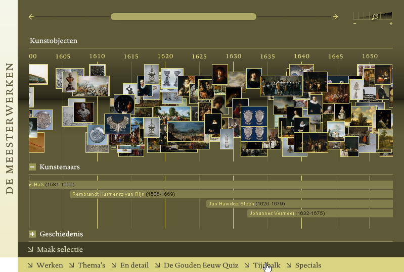

The historical timeline for the website of Rijksmuseum Amsterdam was my first large Flash
project. At that time I was working for Design Studio Fabrique where I graduated on this project
for my study Interaction Design in The Hague in 2004.

Rijksmuseum wanted to present the information about the art-historical objects from their
collection on their website in several different online presentations. It was important to make the
relations between time, art-works, periods in time, historical events and artists visible for the
users of the website in a very interactive way.

One of the presentations Fabrique suggested was a timeline. The Timeline should be very
interactive and dynamic. Interactive for the users, dynamic for the editors at the museum so they
could easily create new compositions of related information. Rijksmuseum was enthusiastic and
the Timeline became my graduation project.

The timeline covers a period of time and shows pictures of art-works. These art-works are in
direct relation with the important artists of that time as well with the historical periods and
events. The relationship becomes even clearer when the user makes a data selection. The user can
for example choose only the paintings to be visible or only the works of a certain artist.
Furthermore the hall were an art-work is being exposed or the subject being painted can serve as
selection criteria. 

One of the most important functionalities of the time is the possibility to zoom in on a certain
period. The editors of the museum can choose which level of detail is available for the users.
The zoom level with the least detail is the one when all art-work and periods are visible in one
overview. On the most detailed level only a very small period of time is visible. At this level you
get a precise view of which art-work has been made in which year, which artists were active and
which historical events happened.

A detailed description is available of each art-work. Clicking on an object will show an
enlargement of the picture with the description and extra details.
The timeline was developed while Flash MX 2004 just became available. Flash MX 2004 closed
the gap between designers and developers. Flash had finally grown up and could now be used to
create serious web applications.

The timeline consists of a set of interface components working closely together, but are separated
according to the Model View Controller principle. The art-historic data is being retrieved from an
enormous XML database. A thematic selection of this data is made by the editors and stored in
the server’s cache. Users can apply filters to narrow the selection.

Technical challenges of this project were to create instantly a large amount of visual objects and
to distribute these objects evenly over the screen. To let the timeline work smoothly it was
necessary to use well considered structured and indexed data within Flash. Another challenge was
the communication between the several interactive presentations. It had to be possible to switch
easily between these presentations making use of the same data and filters. The hundreds of
pictures the timeline uses are scaled by an advanced image server which takes care of all the
pictures used on the Rijksmuseum website.

The website of the Rijksmuseum, with the timeline as an eye-catcher, has been awarded several
times. Soon after the launch of the new website, Rijksmuseum won two German awards, an iF
Award and a Red Dot Award. It also won an American ADC Award and was nominated at
Europrix and SAM Awards. The website has also been added to the Dutch Design Selection 2005. 